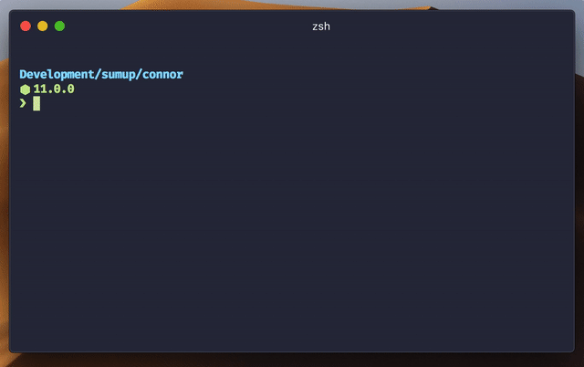

<div align="center">
<h1>:atom_symbol: create-sumup-react-app :atom_symbol:</h1> 

The easiest way to get started writing a React app with SumUp's standard frontend toolchain.
</div>

## :computer: Prerequisites

- You should have Node.js installed at a version equal or above  **`v9.10.0`**. If you cannot do that, see the Troubleshooting section for ways around this requirement.
- At the moment this project reqires `yarn` to be installed on your system. Yarn is a package manager for JavaScript. You can read how to install the Yarn CLI in [their documentation](https://yarnpkg.com/en/docs/install).

## :sparkles: Setting up a new SumUp React project

1. Open your terminal.
2. Navigate to the directory you would like to place your project in.
3. Run `yarn create sumup-react-app {my-app}`, where `my-app` is the name of your project.

This will create the folder `my-app` and initialize a new project inside. The project will be based on [`create-react-app`](https://github.com/facebook/create-react-app) and will use the SumUp's [`Circuit UI`](https://circuit.sumup.com/#/) component library and [Foundry](https://github.com/sumup/foundry) toolkit.

## :hammer_and_wrench: Development workflow

### Firing up the tools

Run `yarn start` to start the development build. The app should automatically open in your browser. Changes you make to `src/App.js` should be visible on the page almost immediately.

To create a production build of your app, run `yarn build`. `react-scripts` will create an optimized production build of your application inside the `build` folder of your project. It will also provide you with additional details on what to do with them.

### Adding a new component

We try making adding new components as easy as possible. Run `yarn create-component YourComponentName` to launch the plop CLI exposed and configured by Foundry.

<div align="center">



</div>

### Linting your code

A linter is a tool that checks your code for

- problems that will cause it to break when run, or
- code style that violates a given set of rules the project is following.

Linting serves as a first line of defence against evil bugs on production.​ Your project will be set up to use a version of the popular [ESLint](https://eslint.org) linter for JavaScript provided by Foundry. You can lint your code and apply automatic fixes by running `yarn lint`. Usually, your editor is able to integrate with ESLint. Check your options and refer to the [Tips](#setting-up-foundry-s-eslint-in-your-editor) section for details on how to make this work with Foundry.

### Writing tests

Writing tests is great. Tests are the second line of defence against bugs ending up on production. By covering your application in unit and integration tests, you can be sure you did not break anything when, for example, shipping refactored code to production. Your new React project comes with testing built in. By running `yarn test` you will start the test runner, [Jest](https://jestjs.io/en/). As you add tests or make changes to your code, Jest will re-run tests and show you the results. The app will come with `react-testing-library` set up for writing UI tests for your React components. Check out `src/App.spec.js` for examples.

## :blue_book: Useful resources

- The [docs](https://github.com/facebook/create-react-app/blob/master/packages/react-scripts/template/README.md#table-of-contents) for `create-react-app` contain a lot of solutions for common problems when writing a React application.
- Foundry [docs](https://github.com/sumup/foundry#table-of-contents).
- Circuit UI [docs](https://circuit.sumup.com/#/) and [storybook](https://circuit.sumup.com/storybook/).
- The [README](https://github.com/kentcdodds/react-testing-library/blob/master/README.md#what-is-react-testing-library) for`react-testing-library`.

## :tipping_hand_woman: Tips

### Setting up Foundry's ESLint in your editor

The great strength of using a toolkit like Foundry is that you as a user do not have to care about  developer dependencies like ESLint. Foundry manages and runs them for you via its `run` command. This, however, becomes a bit tricky when you want your text editor or IDE to run ESLint on your code as you edit it. To get this working, you need to tell your editor where to look for ESLint dependencies.

Your mileage may vary depending on your text editor, but we try to keep a list of instructions here.

#### Visual Studio Code

The ESLint extension for VSCode has a `nodePath` setting. It allows you to add additional paths where the plugin should look when resolving dependencies. By setting it to the default path of Foundry in a project's `node_modules`, you will make VSCode work with Foundry's version of ESLint. Put the following line in your `settings.json`.

```:tipping_hand_man:
"eslint.nodePath": "node_modules/@sumup/foundry/node_modules",
```

Don't worry, this won't break ESLint for other projects. It just gives VSCode another relative path where it can look for ESLint.

## :warning: Troubleshooting

### Engine node is incompatible
```
error eslint@5.0.1: The engine "node" is incompatible with this module. Expected version "^6.14.0 || ^8.10.0 || >=9.10.0".
error Found incompatible module
```

Use a version of node that is compatible with ESLint. If you cannot install it globally, you may try [nvm](https://github.com/creationix/nvm), [nodenv](https://www.google.com/url?sa=t&rct=j&q=&esrc=s&source=web&cd=1&ved=2ahUKEwinuL3IndneAhVLmbQKHRrJCAQQFjAAegQIBhAC&url=https%3A%2F%2Fgithub.com%2Fnodenv%2Fnodenv&usg=AOvVaw0v5LLFjnmygM4rB0ahbDrx), or similar tools.

### Error watching file for changes
```
2017-05-02 09:49 node[8980] (FSEvents.framework) FSEventStreamStart: register_with_server: ERROR: f2d_register_rpc() => (null) (-22)
2017-05-02 09:49 node[8980] (FSEvents.framework) FSEventStreamStart: register_with_server: ERROR: f2d_register_rpc() => (null) (-22)
2017-05-02 09:49 node[8980] (FSEvents.framework) FSEventStreamStart: register_with_server: ERROR: f2d_register_rpc() => (null) (-22)
events.js:163
      throw er; // Unhandled 'error' event
      ^

Error: Error watching file for changes: EMFILE
    at exports._errnoException (util.js:1050:11)
    at FSEvent.FSWatcher._handle.onchange (fs.js:1376:11)
error Command failed with exit code 1.
```

Make sure you have watchman installed. On macOS and Homebrew as your package manager, you can install it with the following line.

```
brew install watchman
```
